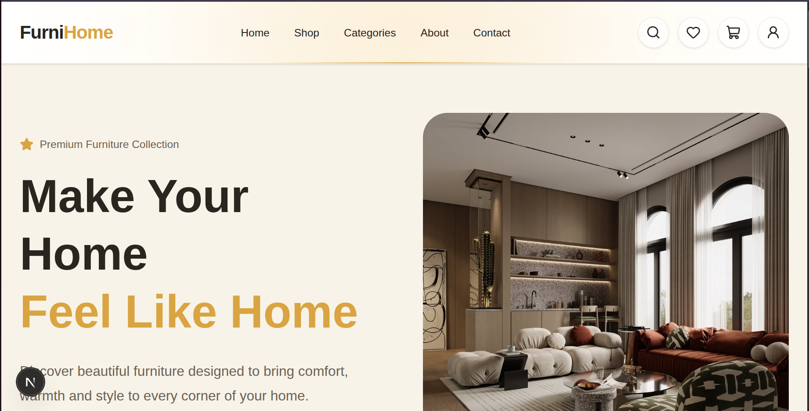

# FurniHome 🛋️

A modern and responsive furniture e-commerce website built with **Next.js** and **Tailwind CSS**.

## Preview



## Features

* 🏠 Modern and responsive homepage
* 🛍️ Product listing and product details
* 🛒 Shopping cart
* ❤️ Wishlist
* 🔐 Login / Sign Up UI
* 🔎 Product search and filtering
* 📦 Checkout page
* 📱 Fully responsive design
* 🎨 Modern furniture-focused UI
* ⚡ Fast navigation with Next.js

## Tech Stack

* **Next.js**
* **React**
* **JavaScript**
* **Tailwind CSS**
* **Lucide React**
* **Next.js App Router**

## Project Structure

```text
furniture-shop/
├── app/
│   ├── about/
│   ├── cart/
│   ├── checkout/
│   ├── components/
│   ├── contact/
│   ├── login/
│   ├── products/
│   └── wishlist/
├── context/
├── data/
├── public/
│   └── images/
├── package.json
└── README.md
```

## Getting Started

Clone the repository:

```bash
git clone https://github.com/Safaeii/furniture-shop.git
```

Go to the project directory:

```bash
cd furniture-shop
```

Install dependencies:

```bash
npm install
```

Run the development server:

```bash
npm run dev
```

Open:

```text
http://localhost:3000
```

## Author

**Safaeii**

GitHub: https://github.com/Safaeii

## License

This project was created for learning and portfolio purposes.
